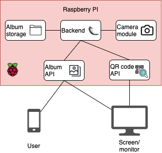

[Back to readme](../readme.md)

# About the system
Camerahub is in general not trying to be more complicated than it needs to be. This means:
- There are no users
- There is no session management
- All images is stored in folders and there is no database

This is some of the reason that the backend is developed in Flask. Developing CameraHub in Django probably would have been overkill when much of the Django functionality is not needed.

# CameraHub architecture
The CameraHub architecture is more or less like this:



The different components in the diagram above will be explained further throughout this document.

# Album storage
The CameraHub project does not use a database and instead relies on just using folders. This is done so that it is not necessary keep a database in sync with the folder structure, making it easier to move image folders back and forth (which is necessary because of limited storage space on the Raspberry PI). While just using folders might not be good performance-wise, CameraHub is not meant to scale anyway, so it is completely fine.

The folder structure for the album storage works as follows:

## Album location
The `albums`-folder (located at `backend/static/albums`) is created when the app starts for the first time and is used to store all album-information. Every album is stored as a folder in the `albums`-folder, and the name of the folder is the name of the album. Rename an album-folder and the album is renamed. Remove an album folder from the `albums`-folder, and the system will no longer know that it has existed.

## Album folder contents
Each album folder **must** contain:
- A folder named `images` which contains the images of the album and **nothing more**.

Each album folder **sometimes** contain:
- `.next_image_number.txt`: Is used by the camera modules to easier know what is to be the number of the next image to capture.
- `thumbnails`: A folder for storing low-resolution versions of the image files. The thumbnails should always be in sync with the images folder. If something is wrong with the thumbnail folder or it is removed, a new one will be created on app-start.

In addition to the files and folders above, each album folder **may** contain:
- A file named `description.txt` with a description of the album
- Other files and folders not used by CameraHub, such as folders containing raw images.

# Album API
Using the endpoints of the API it is possible to create albums, get the images of albums and capture new images to an album. The following endpoints are provided:

## GET `/albums/` -> List available albums
List all available albums in CameraHub and return the names as a JSON-response.

## POST `/albums/` -> Add new album
Create a new album named `<param:album_name>` if it does not already exist. If `<param:description>` is given, update the description of `<param:album_name>` with the contents of `<param:description>`. If successful, a response containing the name of the album and and url for the album info is returned.

## GET `/albums/<album_name>` -> Get information for album
Returns a list of the image links for all images in `<album_name>`. If an album with `<album_name>` does not exist, an error response is returned instead.

## POST `/albums/<album_name>` -> Capture new image to album
Try to capture an image with the camera module and add the image to `<album_name>`. The response will contain the image and thumbnail links for the image which has been captured. If an error has occurred, an error message is returned instead.

## GET `/albums/<album_name>/last_image` -> Get url of last image
Returns the url of the last image captured to `<album_name>`. If `<album_name>` does not exist, the error `"No album with the name <album_name> exists"` will be returned. If the album is empty, the error `"album is empty"` is returned.

# QR Code API
The QR Code API provides information links and information to the QR codes provided by the system. There is only one endpoint:

## GET `/qr_codes` -> Get qr code information
Returns the QR Code information on the following form:
```
"qr_codes": [
  {
    "name": "<name_of_qr_code>",
    "information": "<information text>",
    "url": "<link to qr code image>",
  },
  ...
]
```
With the current setup, just one or two qr codes are returned. This depends if the WiFi QR code is setup or not. See [Create a WiFi QR code](show_wifi_qr_code_on_main_screen.md).

# Camera module
The camera module is the part of the system which handles how images are captured. This process is very simple: 

1. The camera module receives a filepath where a new image should be added
2. The camera module captures an image using a camera
3. The camera module saves the image to the correct location

CameraHub comes with several camera modules. Which camera module to use has to be specified when starting the app. For more information on how to start the app with a camera module, see 
[setting up CameraHub with Raspberry PI](docs/setup_with_raspberry_pi.md).

The current camera modules available are:

- `rpicam` (for Raspberry PI Camera Module)
- `dslr_jpg`
- `dslr_raw`
- `dslr_raw_transfer`
- `dummmy` (default)

It is possible to try out a camera module without running the app by doing:
```
python3 run.py try_camera_module -c <name_of_module>
```
Doing this will create a folder named `test_albums` (in the root of the project) which will contain the image files created.

Some of the camera modules available are described below:
## The dummy camera module
The dummy camera module (`backend/camera_modules/dummy_camera_module.py`) is created for testing purposes, so that it is not necessary to have a camera connected when developing. It is also used when running unit tests.

The module creates white images with randomly colored and positioned circles. How this circle generation is done can be changed by altering the class parameters.
## The "Raspberry PI camera module" camera module
The "Raspberry PI camera module" camera module (`backend/camera_modules/rpicam_module.py`) makes it possible to use CameraHub together with the [Raspberry PI camera module](https://www.raspberrypi.org/documentation/hardware/camera/).

Currently, the module uses the `raspistill` command. For more information about getting started with the RPI camera module, see [the official tutorial](https://projects.raspberrypi.org/en/projects/getting-started-with-picamera).
## The DSLR camera modules
The DSLR camera modules are based on gphoto2 and makes CameraHub compatible with DSLR cameras. Multiple DSLR camera modules exists because there are several ways to configure the capturing process for these cameras with their own advantages and disadvantages.

For more information on the DSLR camera modules, see [Setup DSLR camera on Raspberry PI](setup_dslr_camera.md).

## Creating a new camera module
Most of the basic camera module functionality is implemented in the base class `backend/camera_modules/base_camera_module.py`, so creating a new one should not be that difficult – just create a class which inherits from `BaseCameraModule` and implements the `capture_image`-method. Take a look at [backend/camera_modules/rpicam_module.py](../backend/camera_modules/rpicam_module.py) to see how simple a camera module can be.

Also, when creating a new camera module, remember to update the dictionary `CAMERA_MODULE_OPTIONS` in `backend/camera_module_options.py` with information about the new module.

# Possible improvements to CameraHub
For possible improvements to CameraHub, see [possible improvements](possible_improvements.md).
